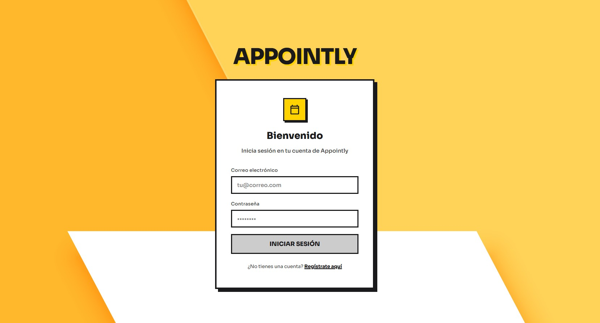
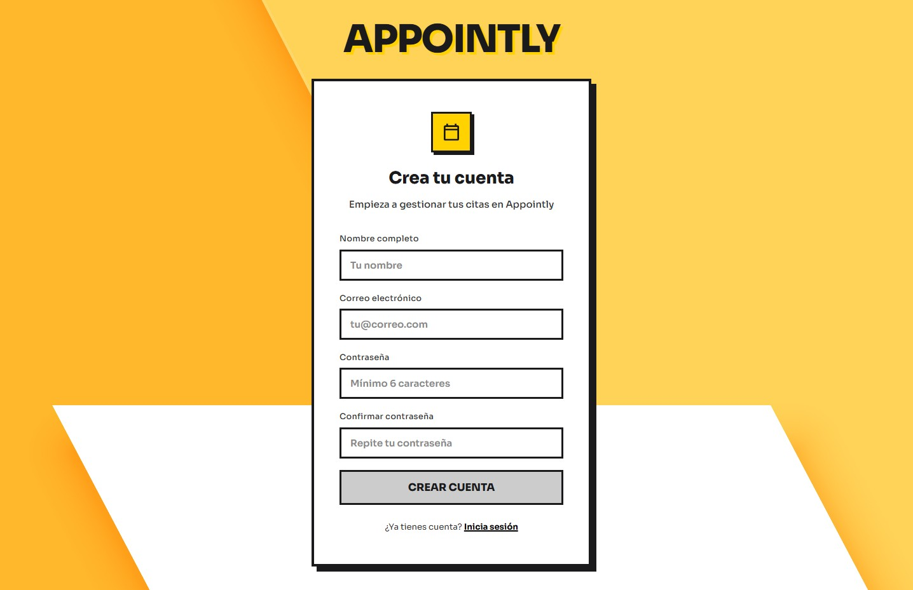
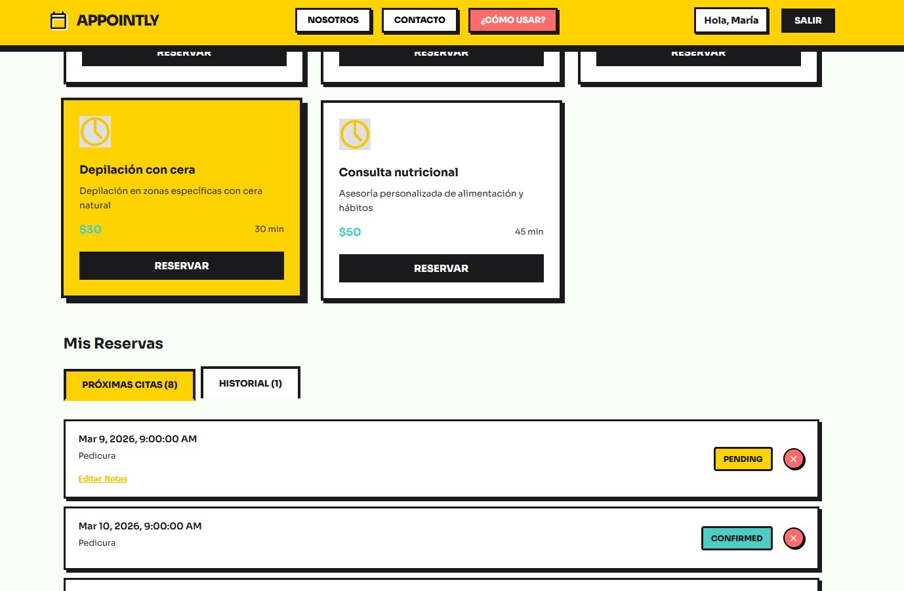
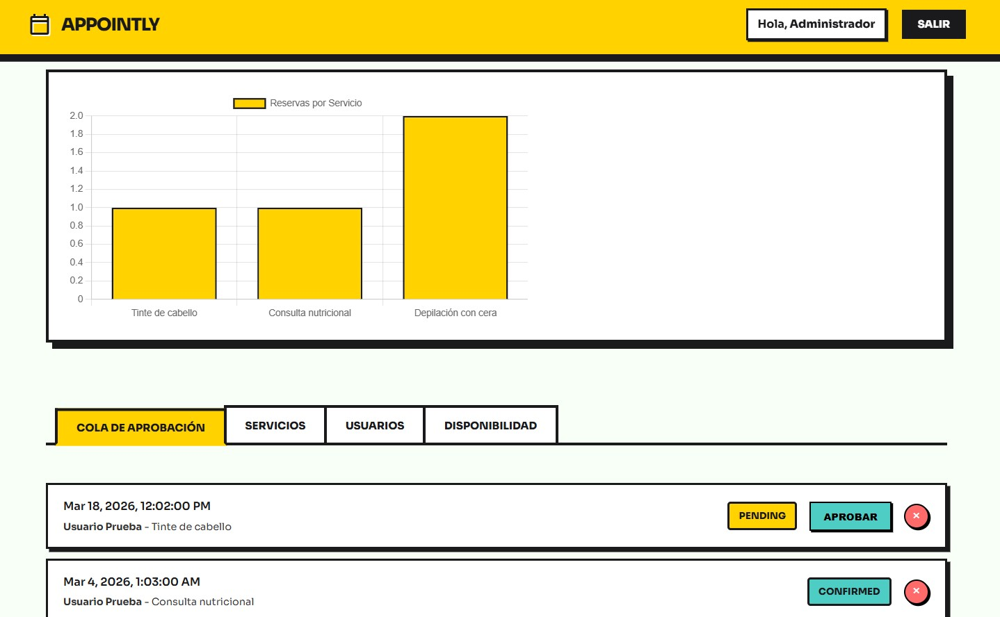

# Appointly
A full-stack application for appointment booking and service management.

## Project Structure
- `backend/` — Spring Boot REST API for users, services, and reservations
- `frontend/` — Angular application for user interface

## Features
- User registration and management
- Service catalog and management
- Reservation creation and management
- RESTful API (Spring Boot)
- In-memory H2 database for development
- User Roles and Authentication using JWT
- **Neobrutalism Design System** with high-contrast UI
- Responsive Angular frontend with Sora typography

## UI Preview


*Consistent high-contrast auth experience.*





*Client dashboard with service grid.*



*Admin dashboard.*



## Requirements
- Java 17 or higher
- Maven
- Node.js & Angular CLI

## Getting Started

### Backend
1. Navigate to the backend folder:
   ```
   cd backend
   ```
2. Build and run the backend:
   ```
   mvn clean install
   mvn spring-boot:run
   ```
   The API will be available at `http://localhost:8080`.

### Frontend
1. Navigate to the frontend folder:
   ```
   cd frontend
   ```
2. Install dependencies and run:
   ```
   npm install
   ng serve
   ```
   The app will be available at `http://localhost:4200`.

## Main API Endpoints

- `POST /api/auth/register` — Register a new user
- `POST /api/auth/login` — Login and get JWT
- `GET /api/services` — List services (Public)
- `GET /api/reservations/my` — View my reservations (Requires JWT)
- `POST /api/reservations` — Create reservation (Requires JWT)
- `DELETE /api/reservations/{id}` — Cancel reservation (Requires JWT)

## Example Reservation JSON
```json
{
  "service": { "id": 2 },
  "reservationDateTime": "2025-07-01T14:00:00",
  "notes": "Please send invoice"
}
```

## Default Credentials (H2 Development)
As the database is in-memory, the following users have been pre-loaded for quick testing:

| Role | Email | Password |
| :--- | :--- | :--- |
| **User** | `test@example.com` | `password123` |
| **Admin** | `admin@appointly.com` | `admin123` |

## Development Notes
- The backend uses an in-memory H2 database that resets on every execution.
- Security is enabled via JWT. Almost all `/api/reservations/**` endpoints require the token in the `Authorization: Bearer <token>` header.
- The frontend is developed in Angular and already integrates an interceptor for session management.
